# HCI-Final-Program——Aura-Voice Report

## **1. Project background** 
### **1.1 Project Background**

In today's society where intelligence is constantly advancing, smart home systems have gradually moved from concept to application, becoming one of the key technologies to improve the quality and convenience of family life. Users are gradually replacing traditional remote control or APP click operations through voice control, becoming the mainstream trend.

### **1.2 Project Introduction** 

This project has added voice recognition function to the traditional smart home system. Users can directly use the voice recognition function to control smart homes in various rooms in their homes, enhancing the convenience of interaction. In addition, users can also directly classify and function management of different homes through the system management interface on their mobile phones.

## **2. Project Design** 
### **2.1 Project Interface Design** 

The main interface of the project is composed of the lower navigation bar. In the main navigation bar below, users can switch between the three main functional interfaces "Voice Recognition", "Device Management", and "User Settings".

### **2.2 Voice Recognition Design** 
The voice recognition interface is divided into two states: before and after recognition. 

Before the recognition starts, the interface mainly includes a start button and prompt for text input 

- Before starting typing: 
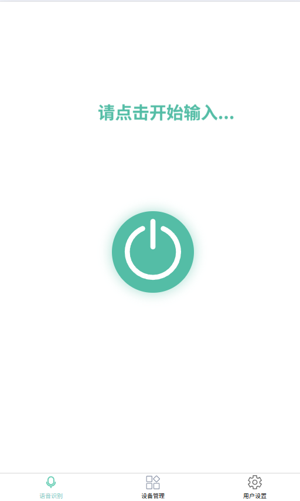 

When the user clicks the Start button, the interface will prompt the user to have started inputting and generate a corresponding dynamic prompt. 

- After starting typing: 
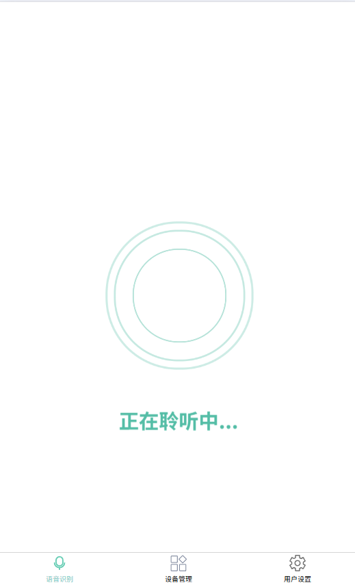

The voice recognition interface provides real-time feedback to users through dynamic responses, and at the same time uses a simple two-color combination, making the style and characteristics more prominent.

### **2.3 Equipment Management Design** 

The device management interface is used to directly control all connected devices on the mobile phone. It is mainly divided into three modules, namely "common scenarios", "rooms", and "detailed devices". Through the designation management interface, users can directly control home devices without using voice recognition function. 

- Equipment Management Overview Picture: 
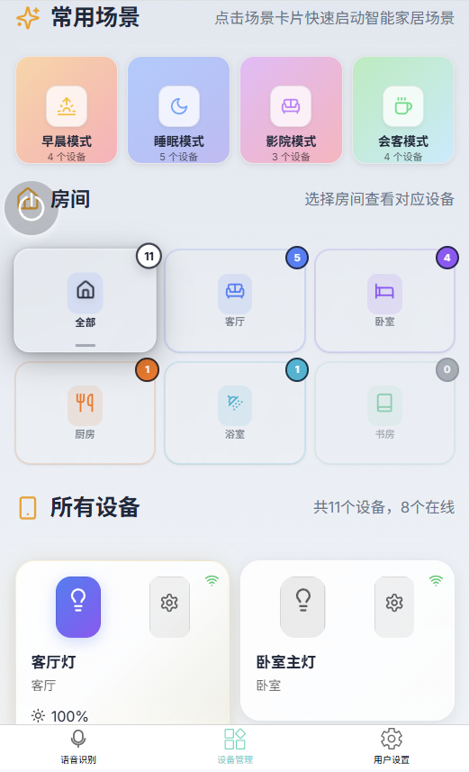 

#### **2.3.1 Common Scenarios** 

In the device management interface, users are provided with common scenario functions. Users can quickly switch the home appliance configuration in the corresponding usage scenarios by selecting common scenarios, allowing users to avoid the hassle of manually adjusting home appliances one by one, and conveniently adjust all home appliances at one time, satisfying the speed and convenience of smart homes. 

- Overview of common scenarios: 
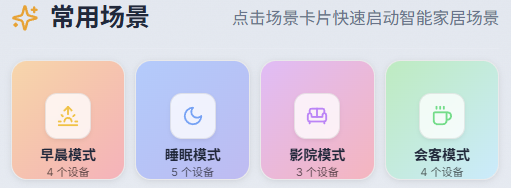 

- Use a scene diagram (taking "morning mode" as an example): 
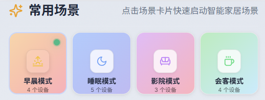 

#### ** Room 2.3.2** 

In the equipment management interface, the entire house is divided into individual rooms, and the rooms are the basic units for different homes. Different furniture is classified according to the different rooms placed, and each room will display the number of equipment in the room, which greatly improves the readability and tidyness of the interface. In the case of too many devices, it is difficult for users to adjust directly, so it is very convenient to allow users to control individually for a certain room. 

- Room overview: 
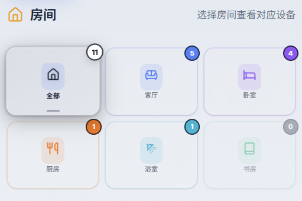 

- Switch room display (taking "living room" as an example): 
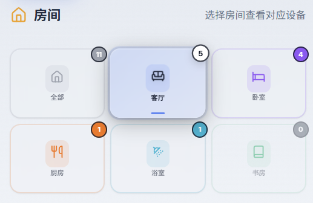 

#### **2.3.3 Detailed Equipment** 

In the management interface, all devices are displayed in separate windows. The device details interface displays all devices in the current room. Displaying all the devices in the current room can make it easier for users to operate. After the user clicks on each individual device, he will enter the detailed setting interface of the device, which facilitates direct control of the home. 

- Overview of all devices: 
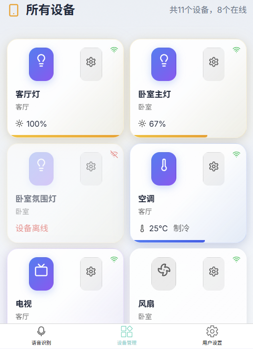 

- Overview of light settings: 

Support linear control of the brightness of the lamp and adjust the switch of the lamp 

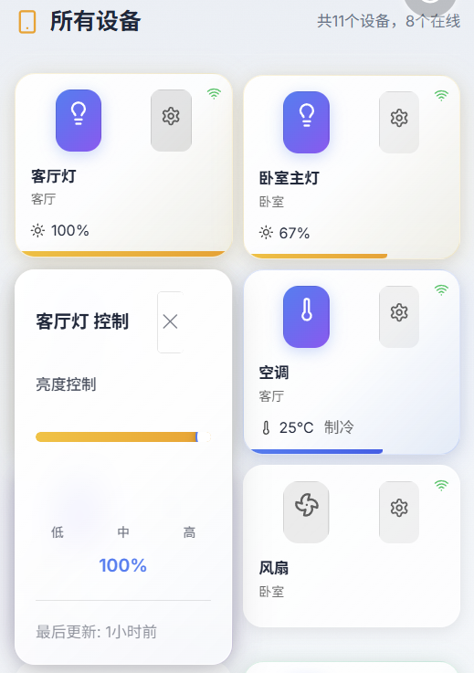 

- Overview of air conditioning settings: 

Supports controlling the temperature of the air conditioner and switching the air conditioner function, and controls the switch of the air conditioner 

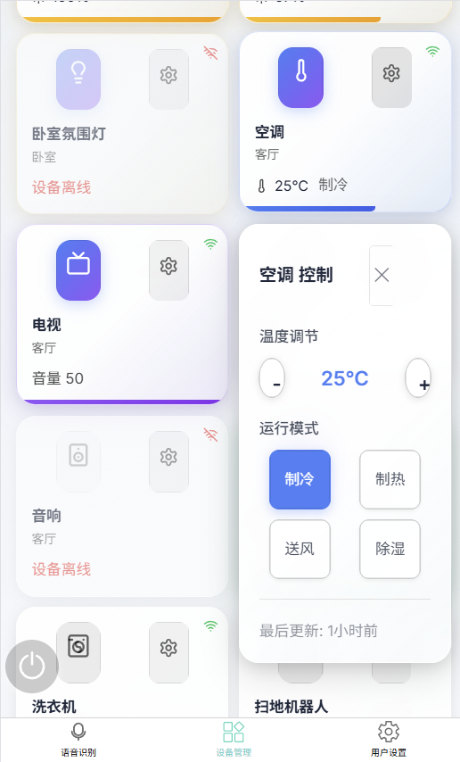 

- TV settings overview: 

Ability to dynamically control the volume of the TV and control the switch of the TV 

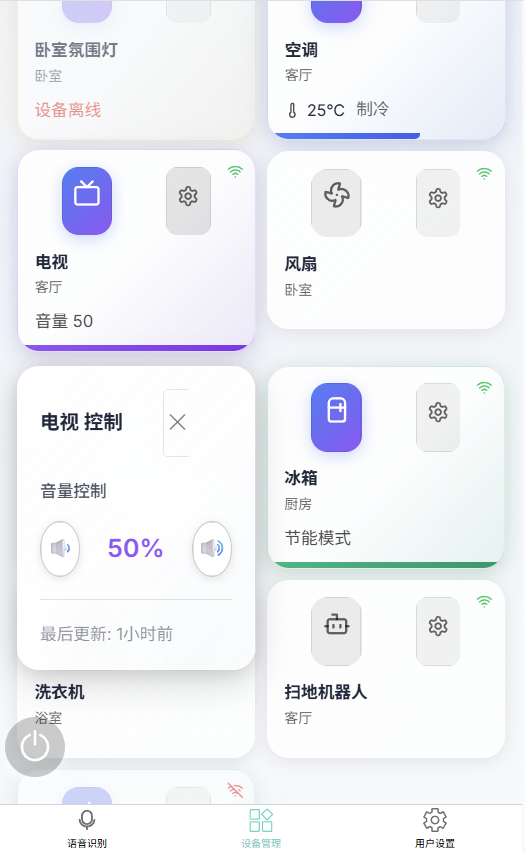 

- Fan Settings Overview: 

Supports controlling the fan wind power, dynamically controlling the fan wind swing, and controlling the fan switch 

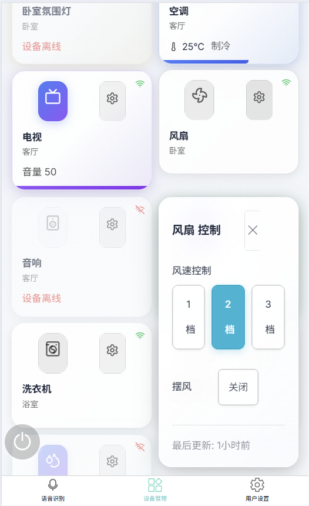 

- Audio settings overview: 

Support dynamically setting the volume of the speaker and controlling the switch of the speaker 

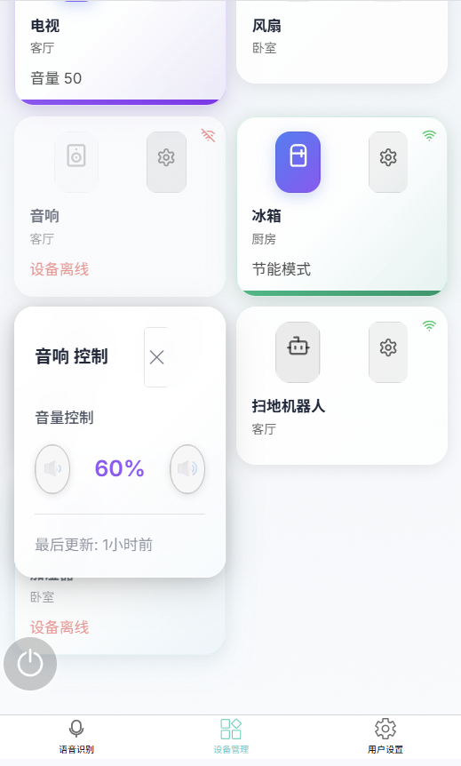

##### **2.3.4悬浮语音窗**

In the device management interface, voice input methods are also provided. Voice input is implemented here through a voice floating window. When the user clicks on the voice floating window, he will enter the voice recognition window and execute relevant instructions by reading the user's voice information, making the user's operation more convenient. 

- Overview of voice floating window closing: 
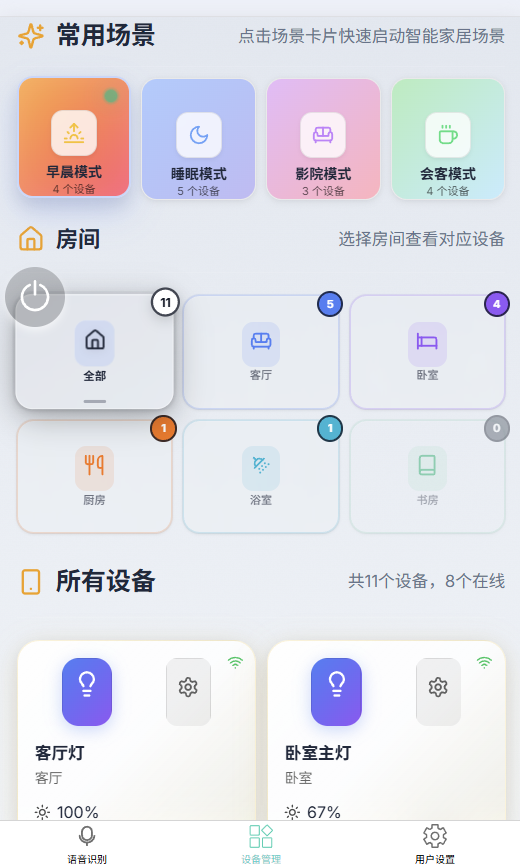 

- Overview of voice window function triggering: 
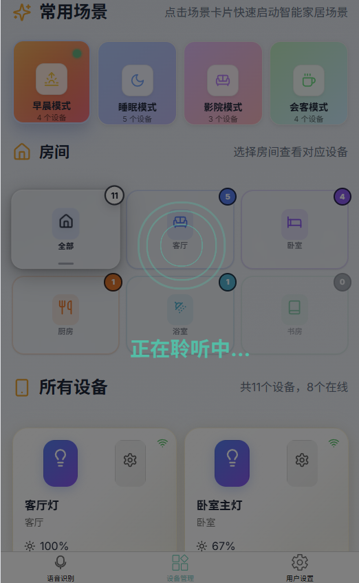
## **3.Interaction Design** 
This system has introduced a number of human-computer interaction principles in its design to improve user experience, operational convenience and accessibility, including the following aspects: 

### **3.1 Feedback Interaction** 

In system design, timely feedback after user operations is attached to system design. When each operation is completed or triggered, the interface has a clearly perceived feedback mechanism, including but not limited to: 

- **Speech recognition status feedback**: When the user initiates voice recognition, the system will display a dynamic ripple animation and prompt "Listening...". When the recognition is completed or cancelled, it will immediately return to a floating ball to provide status switching feedback. 
- ** Equipment operation feedback**: After the user clicks on the switch, adjusts the temperature or wind speed, the device module interface will immediately update the status icon or value, prompting that the operation takes effect. 

### **3.2 Color Contrast for Accessibility** 

The entire system interface uses a high-contrast color scheme to enhance readability in different lighting environments and ensure that users with weak colors or limited vision can still use it clearly: 

- Use ** bright background + dark text** as the main information display style to enhance content visibility. 
- Operation buttons use high saturation colors (such as green buttons represent "on" and gray buttons represent "off") to enhance recognition. 
- The currently selected room or currently running device is highlighted for users to quickly locate. 

In addition, the system has also optimized the size of the icons and interactive areas, supports mobile phone screens of different sizes (responsive design), and ensures that the button area is large enough to meet the touch operation habits. 

### **3.3 Suspended voice ball and immersive recognition mode** 

- **Suspended Voice Ball**: Provides an always accessible voice activation portal. Users can start voice recognition at any location on the page at any time, in line with the interaction principles of "availability" and "fast access". 

### **3.4 Multimode interaction support** 

This system supports **Speech recognition + touch operation** Two interaction methods, users can flexibly choose according to different scenarios: 

| Interaction method | Applicable scenarios | Advantages | 
|---------------------|----------------|-----------------|
| Voice recognition | When driving home, cooking, etc. is inconvenient to operate your phone | Quick and freeing your hands | 
| Touch operation | Detail adjustment, device setting | Accurate and clear feedback | 

Supporting multi-modal interaction helps the system meets the needs of diverse users and improves overall usage efficiency.

## **4. Group division of labor**
| Name | Student ID | Division of labor | 
|------|------|------| 
| Wang Lei | 2351299 | Complete the front-end interface architecture | 
| Li Haotian | 235440 | Complete project logic and other functions to implement | 
| Wei Yigan | 2351232 | Complete the front-end interface architecture | 
| Wang Jiongzhao| 2353819 | Complete project testing and hardware architecture |