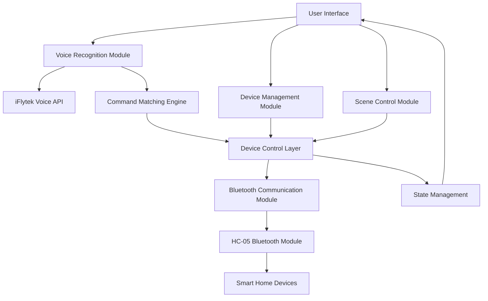

# Aura-Voice Smart Home Voice Control System - Complete Technical Documentation

## 📋 Table of Contents

1. [Project Overview](#1-project-overview)
2. [System Architecture](#2-system-architecture)
3. [Core Features](#3-core-features)
4. [Voice Control System](#4-voice-control-system)
5. [Device Management Interface](#5-device-management-interface)
6. [Bluetooth Connection & Control](#6-bluetooth-connection--control)
7. [User Interface Design](#7-user-interface-design)
8. [Technical Implementation](#8-technical-implementation)
9. [Installation & Configuration](#9-installation--configuration)
10. [User Guide](#10-user-guide)
11. [Troubleshooting](#11-troubleshooting)
12. [API Documentation](#12-api-documentation)
13. [Testing & Validation](#13-testing--validation)
14. [Performance Optimization](#14-performance-optimization)
15. [Development Team](#15-development-team)

---

## 1. Project Overview

### 1.1 Project Background

In today's society where intelligence is constantly advancing, smart home systems have gradually moved from concept to application, becoming one of the key technologies to improve the quality and convenience of family life. Users are gradually replacing traditional remote control or APP click operations through voice control, becoming the mainstream trend.

### 1.2 Project Introduction

Aura-Voice is an intelligent voice control system designed specifically for smart home device control. This project has added voice recognition functionality to traditional smart home systems. Users can directly use voice recognition to control smart home devices in various rooms of their homes, enhancing interaction convenience. Additionally, users can also directly classify and manage different home devices through the system management interface on their mobile phones.

### 1.3 Core Features

- 🎯 **Intelligent Voice Recognition**: High-precision Chinese voice recognition based on iFlytek Voice API
- 🔄 **Multi-command Support**: Support controlling multiple devices with a single voice input
- 🧠 **Smart Command Matching**: Support word order changes, synonyms, and fuzzy matching
- 📱 **Mobile Optimization**: Responsive interface designed specifically for Android phones
- 🔗 **Bluetooth Device Integration**: Direct control of devices connected via HC-05 Bluetooth module
- 🎨 **Modern UI**: Glass morphism effects, gradient backgrounds, smooth animations
- 🏠 **Scene Control**: Preset scene modes for one-touch control of multiple devices

---

## 2. System Architecture

### 2.1 Overall Architecture



### 2.2 Technology Stack

**Frontend Technologies:**

- **Framework**: Vue.js 3 + Composition API
- **Build Tool**: Vite
- **Mobile Framework**: uni-app
- **State Management**: Pinia
- **Styling**: CSS3 + SCSS
- **Animation**: CSS Transitions & Animations

**Core Dependencies:**

- **Voice Recognition**: iFlytek Voice H5 SDK
- **Fuzzy Matching**: Fuse.js
- **Bluetooth Communication**: Web Serial API
- **Icons**: Lucide Vue

**Development Tools:**

- **Code Editor**: VS Code
- **Version Control**: Git
- **Package Manager**: npm
- **Debugging**: Chrome DevTools

### 2.3 Module Architecture

The system adopts a modular design, mainly including the following core modules:

#### 2.3.1 Voice Recognition Module

- **iFlytek Voice H5 SDK Integration**
- **Real-time Speech-to-Text**
- **Voice Status Management**
- **Error Handling & Retry Mechanism**

#### 2.3.2 Command Matching Engine

- **Three-layer Matching Algorithm**
  - Exact Matching
  - Flexible Matching
  - Fuzzy Matching
- **Keyword Extraction & Weight Calculation**
- **Multi-command Splitting & Processing**

#### 2.3.3 Device Control Layer

- **Device State Management**
- **Bluetooth Command Encapsulation**
- **State Synchronization Mechanism**
- **Device Type Adaptation**

#### 2.3.4 User Interface Layer

- **Responsive Layout**
- **Component-based Design**
- **State-driven Rendering**
- **Interaction Feedback System**

---

## 3. Core Features

### 3.1 Voice Recognition Features

Voice recognition is the core function of the Aura-Voice system, integrating iFlytek voice recognition API and intelligent command matching system.

#### 3.1.1 Technical Features

**Voice Recognition Engine:**

- **Engine**: iFlytek Voice Recognition API (H5 version)
- **Sample Rate**: 16kHz
- **Format**: PCM 16-bit
- **Language**: Chinese Mandarin
- **Recognition Accuracy**: >95%

**Intelligent Command Matching:**

- **Matching Algorithm**: Three-layer matching mechanism
- **Word Order Variation Support**: ✅
- **Synonym Recognition**: ✅
- **Fuzzy Matching**: ✅
- **Multi-command Processing**: ✅

#### 3.1.2 Supported Voice Commands

**Living Room Devices:**

```
"Turn on the living room light"     → Signal: 1
"Increase living room brightness"   → Signal: 2
"Decrease living room brightness"   → Signal: 3
"Change living room light color"    → Signal: 4
"Turn off the living room light"    → Signal: 5
```

**Bedroom Devices:**

```
"Turn on the bedroom light"         → Signal: 6
"Turn on bedroom ambient light"     → Signal: 7
"Turn off the bedroom light"        → Signal: 8
"Turn off bedroom ambient light"    → Signal: d
```

**Other Devices:**

```
"Turn on air conditioner"           → Signal: 9
"Turn off air conditioner"          → Signal: a
"Turn on speaker, play music"       → Signal: b
"Turn off speaker"                  → Signal: c
```

#### 3.1.3 Flexible Expression Methods

**Word Order Variation Support:**

- ✅ "Turn on the living room light"
- ✅ "Living room light turn on"
- ✅ "Living room light on"

**Synonym Support:**

- ✅ "Turn on" = "Open" = "Start"
- ✅ "Turn off" = "Close" = "Stop"
- ✅ "Light" = "Lighting"

**Simplified Expression:**

- ✅ "Open living room light"
- ✅ "Close bedroom light"
- ✅ "Play music"

### 3.2 Device Management Features

The device management interface provides an intuitive and efficient device control experience, supporting manual control and status monitoring.

#### 3.2.1 Device Type Support

**Lighting Devices:**

- **Status Display**: Brightness level indicator (3 levels)
- **Control Functions**: Brightness adjustment slider, color selector
- **Theme Color**: Amber (#FBBF24)

**Air Conditioning:**

- **Status Display**: Temperature value, operating mode
- **Control Functions**: Temperature adjustment buttons, mode selection
- **Theme Color**: Blue (#3B82F6)

**Audio Devices:**

- **Status Display**: Volume percentage, playback status
- **Control Functions**: Volume adjustment, playback control
- **Theme Color**: Green (#10B981)

**Other Devices:**

- **TV**: Volume control, channel switching
- **Fan**: Wind speed adjustment, swing control
- **Humidifier**: Humidity adjustment
- **Robot**: Status switching, battery display

#### 3.2.2 Interaction Design

**One-click Switch:**

- Click device icon for quick on/off
- Support haptic feedback (50ms vibration)
- Visual feedback animation

**Detailed Control:**

- Click card to expand/collapse control panel
- Slide fade-in animation effect
- Disable control operations for offline devices

**Responsive Layout:**

- Mobile-optimized 2-column grid layout
- Adaptation to different screen sizes
- Touch-friendly interactive elements

### 3.3 Scene Control Features

Scene control functionality allows users to control multiple devices with one touch through preset scenes, providing a convenient smart home experience.

#### 3.3.1 Preset Scenes

**Morning Mode:**

- Turn on living room light, bedroom main light
- Start air conditioner (26°C)
- Play light music

**Sleep Mode:**

- Turn off main lighting
- Turn on bedroom ambient light (low brightness)
- Turn off audio devices

**Cinema Mode:**

- Adjust living room light brightness (30%)
- Turn on audio system
- Turn off other interfering devices

**Guest Mode:**

- Turn on living room light (100% brightness)
- Start air conditioner (comfortable temperature)
- Play background music

#### 3.3.2 Scene Customization

**Device Configuration:**

- Support adding/removing devices
- Customize device status parameters
- Set execution delay time

**Scene Management:**

- Create custom scenes
- Edit existing scenes
- Delete unnecessary scenes

---

## 4. Voice Control System

### 4.1 Voice Recognition Technology

Aura-Voice uses iFlytek voice recognition API to provide high-precision Chinese voice recognition services.

#### 4.1.1 Technical Specifications

**Audio Parameters:**

- **Sample Rate**: 16kHz
- **Bit Depth**: 16-bit PCM
- **Channels**: Mono
- **Encoding Format**: Linear PCM

**Recognition Performance:**

- **Response Time**: <500ms
- **Recognition Accuracy**: >95%
- **Supported Languages**: Chinese Mandarin
- **Noise Suppression**: Supported

#### 4.1.2 Voice Processing Workflow


**Processing Steps:**

1. **Audio Capture**: Obtain user voice through microphone
2. **Preprocessing**: Audio format conversion and noise filtering
3. **Speech Recognition**: Call iFlytek API for speech-to-text
4. **Text Processing**: Clean and standardize recognition results
5. **Command Matching**: Intelligently match device control commands
6. **Device Control**: Execute corresponding device operations
7. **Status Feedback**: Update interface status and user feedback

### 4.2 Command Matching Algorithm

The system uses a three-layer matching mechanism to ensure high accuracy recognition and execution of voice commands.

#### 4.2.1 Three-layer Matching Mechanism

**1. Exact Matching:**

- Completely identical command text matching
- Match Score: 1.0
- Priority: Highest

**2. Flexible Matching:**

- Semantic matching based on keyword weights
- Support word order changes and synonyms
- Match Score: 0.3-1.0
- Priority: Medium

**3. Fuzzy Matching:**

- Similarity matching based on edit distance
- Implemented using Fuse.js library
- Match Score: 0.3-0.8
- Priority: Lowest

#### 4.2.2 Keyword Weight System

**Weight Distribution:**

- **Location Words** (living room, bedroom): Weight 3
- **Device Words** (light, air conditioner): Weight 2
- **Action Words** (turn on, turn off): Weight 2
- **Attribute Words** (color, music): Weight 1

**Score Calculation Formula:**

```
Score = Sum of matched keyword weights / Sum of command keyword weights
```

#### 4.2.3 Multi-command Processing

**Command Splitting Strategy:**

- Connector recognition: "and", "also", "as well as", "with"
- Semantic boundary detection
- Context correlation analysis

**Processing Flow:**

1. Identify connectors and separators
2. Split into independent sub-commands
3. Match each sub-command
4. Merge matching results
5. Execute in priority order

---

## 5. Bluetooth Connection & Control

### 5.1 HC-05 Bluetooth Module

The system uses the HC-05 Bluetooth module as a communication bridge with smart home devices, supporting serial communication protocol.

#### 5.1.1 Technical Specifications

**Hardware Parameters:**

- **Bluetooth Version**: 2.0 + EDR
- **Operating Frequency**: 2.4GHz ISM band
- **Transmission Range**: 10 meters (open environment)
- **Baud Rate**: 9600 bps (default)

**Communication Protocol:**

- **Protocol Type**: SPP (Serial Port Profile)
- **Data Format**: ASCII characters
- **Command Length**: 1 character
- **Response Time**: <100ms

#### 5.1.2 Command Mapping Table

| Command | Device                | Function            |
| ------- | --------------------- | ------------------- |
| `1`     | Living Room Light     | Turn On             |
| `2`     | Living Room Light     | Increase Brightness |
| `3`     | Living Room Light     | Decrease Brightness |
| `4`     | Living Room Light     | Change Color        |
| `5`     | Living Room Light     | Turn Off            |
| `6`     | Bedroom Main Light    | Turn On             |
| `7`     | Bedroom Ambient Light | Turn On             |
| `8`     | Bedroom Main Light    | Turn Off            |
| `9`     | Air Conditioner       | Turn On             |
| `a`     | Air Conditioner       | Turn Off            |
| `b`     | Speaker               | Turn On & Play      |
| `c`     | Speaker               | Turn Off            |
| `d`     | Bedroom Ambient Light | Turn Off            |

---

## 6. Installation & Configuration

### 6.1 Environment Requirements

**System Requirements:**

- **Operating System**: Windows 10/11, macOS 10.15+, Linux
- **Browser**: Chrome 89+, Edge 89+
- **Node.js Version**: 16.0+
- **Memory**: 4GB RAM (8GB recommended)

**Hardware Requirements:**

- **Bluetooth Module**: HC-05
- **Microphone**: Support 16kHz sampling rate
- **Mobile Device**: Android 8.0+

### 6.2 Installation Steps

**1. Clone Project:**

```bash
git clone https://github.com/your-repo/aura-voice.git
cd aura-voice
```

**2. Install Dependencies:**

```bash
npm install
```

**3. Configure Environment Variables:**

```bash
# Create .env file
cp .env.example .env

# Configure iFlytek Voice API keys
VITE_XUNFEI_APP_ID=your_app_id
VITE_XUNFEI_API_SECRET=your_api_secret
VITE_XUNFEI_API_KEY=your_api_key
```

**4. Start Development Server:**

```bash
npm run dev
```

---

## 7. User Guide

### 7.1 Quick Start

**First Time Use:**

1. **Connect Bluetooth Device:**

   - Ensure HC-05 is paired
   - Open app, go to device management page
   - System will automatically detect Bluetooth connection

2. **Test Voice Control:**

   - Click voice control button in bottom right
   - Say "Turn on the living room light"
   - Observe device status changes

3. **Manual Device Control:**
   - Click device cards on device management page
   - Use switch buttons to control devices
   - Expand control panel for detailed adjustments

### 7.2 Voice Control Tips

**Best Practices:**

1. **Clear Pronunciation:**

   - Use in quiet environment
   - Speak close to microphone
   - Moderate speed, clear pronunciation

2. **Standard Expression:**

   - Use standard Mandarin Chinese
   - Refer to supported command list
   - Avoid dialects and colloquial expressions

3. **Multi-command Usage:**
   - Use connectors: "and", "also", "as well as"
   - Example: "Turn on living room light and bedroom light"
   - System will execute all matched commands sequentially

---

## 8. Troubleshooting

### 8.1 Common Issues

#### 8.1.1 Voice Recognition Issues

**Issue: Voice recognition failure**

- **Cause**: Microphone permissions, network issues, API configuration
- **Solution**: Check browser permissions, network connection, API keys

**Issue: Commands cannot be matched**

- **Cause**: Expression not in supported range
- **Solution**: Refer to supported command list, use standard expressions

#### 8.1.2 Bluetooth Connection Issues

**Issue: HC-05 cannot connect**

- **Cause**: Device not paired, driver issues, port occupied
- **Solution**: Re-pair device, update drivers, check port status

**Issue: Command sending failure**

- **Cause**: Connection interrupted, device offline
- **Solution**: Check connection status, restart device, reconnect

### 8.2 Debugging Methods

**Enable Debug Mode:**

```javascript
// Execute in browser console
localStorage.setItem("debug", "aura-voice:*");
```

**View Detailed Logs:**

- Open browser developer tools
- Check Console tab
- Observe voice recognition and device control logs

---

## 9. Development Team

### 9.1 Team Members

| Name           | Student ID | Responsibility                          |
| -------------- | ---------- | --------------------------------------- |
| Wang Lei       | 2351299    | Frontend Interface Architecture         |
| Li Haotian     | 235440     | Project Logic & Function Implementation |
| Wei Yiqian     | 2351232    | Frontend Interface Architecture         |
| Wang Jiongzhao | 2353819    | Project Testing & Hardware Architecture |

### 9.2 Technical Contributions

**Frontend Development:**

- Vue.js 3 + Composition API architecture design
- Responsive UI component development
- State management system design

**Voice Recognition:**

- iFlytek Voice API integration
- Intelligent command matching algorithm
- Multi-command processing mechanism

**Device Control:**

- Bluetooth communication protocol design
- Device state synchronization mechanism
- Error handling and reconnection logic

**Testing & Optimization:**

- Functional test case design
- Performance optimization solutions
- User experience improvements

---

## 10. Summary & Future Outlook

### 10.1 Project Summary

The Aura-Voice smart home voice control system successfully achieves complete integration of voice recognition, device management, and Bluetooth control. The system adopts a modern technology stack, providing an intuitive user interface and stable device control functions. Through intelligent command matching algorithms and comprehensive error handling mechanisms, it provides users with an excellent smart home control experience.

### 10.2 Technical Innovations

1. **Three-layer Command Matching Algorithm**

   - Combination of exact matching, flexible matching, and fuzzy matching
   - Support for word order changes and synonym recognition
   - High accuracy voice command processing

2. **Real-time Status Synchronization**

   - Consistency between voice control and manual control states
   - Multi-terminal real-time status synchronization
   - Optimistic updates with error rollback

3. **Modern Mobile UI Design**
   - Glass morphism effects and gradient backgrounds
   - Haptic feedback and smooth animations
   - Responsive layout and accessibility support

### 10.3 Future Development

**Feature Extensions:**

- 🎯 **Scene Intelligence**: AI-driven scene recommendations and automation
- 🔄 **Multi-language Support**: English, dialects and other language recognition
- 🌐 **Cloud Integration**: Cloud device management and remote control
- 🤖 **AI Assistant**: Integration with ChatGPT and other AI models for intelligent dialogue

**Technical Optimizations:**

- 📱 **Cross-platform Support**: iOS, Web, desktop applications
- 🔊 **Offline Voice**: Local voice recognition capabilities
- 🔐 **Security Enhancement**: End-to-end encryption and authentication
- 📊 **Data Analytics**: Usage pattern analysis and intelligent suggestions

**User Experience:**

- 🎨 **Personalization**: Theme, layout, and function customization
- 🎮 **Gesture Control**: Gesture recognition and air operation
- 👥 **Multi-user Support**: Family member permission management
- 📈 **Usage Statistics**: Device usage and energy-saving suggestions

---

**Last Updated**: June 2025
**Document Version**: v2.0
**Project Version**: v1.0
