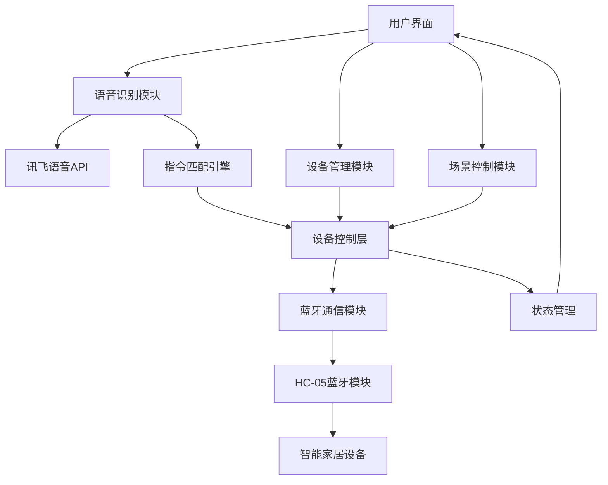

# Aura-Voice 智能家居语音控制系统 - 完整技术文档

## 📋 目录

1. [项目概述](#1-项目概述)
2. [系统架构](#2-系统架构)
3. [核心功能](#3-核心功能)
4. [语音控制系统](#4-语音控制系统)
5. [设备管理界面](#5-设备管理界面)
6. [蓝牙连接与控制](#6-蓝牙连接与控制)
7. [用户界面设计](#7-用户界面设计)
8. [技术实现](#8-技术实现)
9. [安装与配置](#9-安装与配置)
10. [使用指南](#10-使用指南)
11. [故障排除](#11-故障排除)
12. [API 文档](#12-api文档)
13. [测试与验证](#13-测试与验证)
14. [性能优化](#14-性能优化)
15. [开发团队](#15-开发团队)

---

## 1. 项目概述

### 1.1 项目背景

在智能化不断发展的今天，智能家居系统已经从概念走向应用，成为提升家庭生活品质和便利性的关键技术之一。用户正在逐步通过语音控制替代传统的遥控器或 APP 点击操作，这已成为主流趋势。

### 1.2 项目介绍

Aura-Voice 是一个智能语音控制系统，专为智能家居设备控制而设计。本项目在传统智能家居系统基础上增加了语音识别功能，用户可以直接使用语音识别功能控制家中各个房间的智能家居设备，增强了交互的便利性。此外，用户还可以通过手机上的系统管理界面直接对不同家居设备进行分类和功能管理。

### 1.3 核心特性

- 🎯 **智能语音识别**：基于讯飞语音 API 的高精度中文语音识别
- 🔄 **多命令支持**：支持一次语音输入控制多个设备
- 🧠 **智能指令匹配**：支持词序变化、同义词、模糊匹配
- 📱 **移动端优化**：专为安卓手机端设计的响应式界面
- 🔗 **蓝牙设备集成**：直接控制 HC-05 蓝牙模块连接的设备
- 🎨 **现代化 UI**：毛玻璃效果、渐变背景、流畅动画
- 🏠 **场景控制**：预设场景模式，一键控制多个设备

---

## 2. 系统架构

### 2.1 整体架构



### 2.2 技术栈

**前端技术：**

- **框架**: Vue.js 3 + Composition API
- **构建工具**: Vite
- **移动端框架**: uni-app
- **状态管理**: Pinia
- **样式**: CSS3 + SCSS
- **动画**: CSS Transitions & Animations

**核心依赖：**

- **语音识别**: 讯飞语音 H5 SDK
- **模糊匹配**: Fuse.js
- **蓝牙通信**: Web Serial API
- **图标**: Lucide Vue

**开发工具：**

- **代码编辑器**: VS Code
- **版本控制**: Git
- **包管理器**: npm
- **调试工具**: Chrome DevTools

### 2.3 模块架构

系统采用模块化设计，主要包含以下核心模块：

#### 2.3.1 语音识别模块

- **讯飞语音 H5 SDK 集成**
- **实时语音转文字**
- **语音状态管理**
- **错误处理与重试机制**

#### 2.3.2 指令匹配引擎

- **三层匹配算法**
  - 精确匹配
  - 灵活匹配
  - 模糊匹配
- **关键词提取与权重计算**
- **多命令分割与处理**

#### 2.3.3 设备控制层

- **设备状态管理**
- **蓝牙指令封装**
- **状态同步机制**
- **设备类型适配**

#### 2.3.4 用户界面层

- **响应式布局**
- **组件化设计**
- **状态驱动渲染**
- **交互反馈系统**

---

## 3. 核心功能

### 3.1 语音识别功能

语音识别是 Aura-Voice 系统的核心功能，整合了讯飞语音识别 API 和智能指令匹配系统。

#### 3.1.1 技术特性

**语音识别引擎：**

- **引擎**: 讯飞语音识别 API (H5 版本)
- **采样率**: 16kHz
- **格式**: PCM 16 位
- **语言**: 中文普通话
- **识别精度**: >95%

**智能指令匹配：**

- **匹配算法**: 三层匹配机制
- **支持词序变化**: ✅
- **同义词识别**: ✅
- **模糊匹配**: ✅
- **多命令处理**: ✅

#### 3.1.2 支持的语音指令

**客厅设备：**

```
"打开客厅的灯"          → 信号: 1
"加大客厅的灯光"        → 信号: 2
"降低客厅的灯光"        → 信号: 3
"转换客厅的灯光颜色"    → 信号: 4
"关闭客厅的灯光"        → 信号: 5
```

**卧室设备：**

```
"打开卧室的灯"          → 信号: 6
"打开卧室的氛围灯"      → 信号: 7
"关闭卧室的灯"          → 信号: 8
"关闭卧室的氛围灯"      → 信号: d
```

**其他设备：**

```
"打开空调"              → 信号: 9
"关闭空调"              → 信号: a
"打开音响，放一首歌"    → 信号: b
"关闭音响"              → 信号: c
```

#### 3.1.3 灵活表达方式

**词序变化支持：**

- ✅ "打开客厅的灯"
- ✅ "客厅的灯打开"
- ✅ "客厅灯打开"

**同义词支持：**

- ✅ "打开" = "开启" = "启动"
- ✅ "关闭" = "关掉" = "停止"
- ✅ "灯" = "灯光"

**简化表达：**

- ✅ "开客厅灯"
- ✅ "关卧室灯"
- ✅ "播放音乐"

### 3.2 设备管理功能

设备管理界面提供直观、高效的设备控制体验，支持手动控制和状态监控。

#### 3.2.1 设备类型支持

**灯光设备：**

- **状态显示**: 亮度等级指示器（3 档）
- **控制功能**: 亮度调节滑块、颜色选择器
- **主题色**: 琥珀色 (#FBBF24)

**空调设备：**

- **状态显示**: 温度值、运行模式
- **控制功能**: 温度调节按钮、模式选择
- **主题色**: 蓝色 (#3B82F6)

**音响设备：**

- **状态显示**: 音量百分比、播放状态
- **控制功能**: 音量调节、播放控制
- **主题色**: 绿色 (#10B981)

**其他设备：**

- **电视**: 音量控制、频道切换
- **风扇**: 风速调节、摆风控制
- **加湿器**: 湿度调节
- **机器人**: 状态切换、电量显示

#### 3.2.2 交互设计

**一键开关：**

- 点击设备图标进行快速开关
- 支持触觉反馈（50ms 振动）
- 视觉反馈动画

**详细控制：**

- 点击卡片展开/收起控制面板
- 滑动淡入动画效果
- 禁用离线设备的控制操作

**响应式布局：**

- 移动端优化的 2 列网格布局
- 不同屏幕尺寸的适配
- 触摸友好的交互元素

### 3.3 场景控制功能

场景控制功能允许用户通过预设场景一键控制多个设备，提供便捷的智能家居体验。

#### 3.3.1 预设场景

**早晨模式：**

- 开启客厅灯、卧室主灯
- 启动空调（26°C）
- 播放轻音乐

**睡眠模式：**

- 关闭主要照明
- 开启卧室氛围灯（低亮度）
- 关闭音响设备

**影院模式：**

- 调节客厅灯亮度（30%）
- 开启音响系统
- 关闭其他干扰设备

**会客模式：**

- 开启客厅灯（100%亮度）
- 启动空调（舒适温度）
- 播放背景音乐

#### 3.3.2 场景自定义

**设备配置：**

- 支持添加/移除设备
- 自定义设备状态参数
- 设置执行延迟时间

**场景管理：**

- 创建自定义场景
- 编辑现有场景
- 删除不需要的场景

---

## 4. 语音控制系统

### 4.1 语音识别技术

Aura-Voice 采用讯飞语音识别 API，提供高精度的中文语音识别服务。

#### 4.1.1 技术规格

**音频参数：**

- **采样率**: 16kHz
- **位深度**: 16-bit PCM
- **声道**: 单声道 (Mono)
- **编码格式**: Linear PCM

**识别性能：**

- **响应时间**: <500ms
- **识别准确率**: >95%
- **支持语言**: 中文普通话
- **噪音抑制**: 支持

#### 4.1.2 语音处理流程


**处理步骤：**

1. **音频采集**: 通过麦克风获取用户语音
2. **预处理**: 音频格式转换和噪音过滤
3. **语音识别**: 调用讯飞 API 进行语音转文字
4. **文本处理**: 清理和标准化识别结果
5. **指令匹配**: 智能匹配设备控制指令
6. **设备控制**: 执行相应的设备操作
7. **状态反馈**: 更新界面状态和用户反馈

### 4.2 指令匹配算法

系统采用三层匹配机制，确保语音指令的高准确率识别和执行。

#### 4.2.1 三层匹配机制

**1. 精确匹配：**

- 完全相同的指令文本匹配
- 匹配得分: 1.0
- 优先级: 最高

**2. 灵活匹配：**

- 基于关键词权重的语义匹配
- 支持词序变化和同义词
- 匹配得分: 0.3-1.0
- 优先级: 中等

**3. 模糊匹配：**

- 基于编辑距离的相似度匹配
- 使用 Fuse.js 库实现
- 匹配得分: 0.3-0.8
- 优先级: 最低

#### 4.2.2 关键词权重系统

**权重分配：**

- **位置词** (客厅、卧室): 权重 3
- **设备词** (灯、空调): 权重 2
- **动作词** (打开、关闭): 权重 2
- **属性词** (颜色、音乐): 权重 1

**得分计算公式：**

```
得分 = 匹配的关键词权重总和 / 命令中关键词权重总和
```

#### 4.2.3 多命令处理

**命令分割策略：**

- 连接词识别: "和"、"还有"、"以及"、"与"
- 语义边界检测
- 上下文关联分析

**处理流程：**

1. 识别连接词和分隔符
2. 分割为独立的子命令
3. 为每个子命令进行匹配
4. 合并匹配结果
5. 按优先级排序执行

---

## 5. 蓝牙连接与控制

### 5.1 HC-05 蓝牙模块

系统使用 HC-05 蓝牙模块作为与智能家居设备的通信桥梁，支持串口通信协议。

#### 5.1.1 技术规格

**硬件参数：**

- **蓝牙版本**: 2.0 + EDR
- **工作频率**: 2.4GHz ISM 频段
- **传输距离**: 10 米（开阔环境）
- **波特率**: 9600 bps（默认）

**通信协议：**

- **协议类型**: SPP (Serial Port Profile)
- **数据格式**: ASCII 字符
- **指令长度**: 1 字符
- **响应时间**: <100ms

#### 5.1.2 指令映射表

| 指令 | 设备       | 功能       |
| ---- | ---------- | ---------- |
| `1`  | 客厅灯     | 打开       |
| `2`  | 客厅灯     | 增加亮度   |
| `3`  | 客厅灯     | 降低亮度   |
| `4`  | 客厅灯     | 切换颜色   |
| `5`  | 客厅灯     | 关闭       |
| `6`  | 卧室主灯   | 打开       |
| `7`  | 卧室氛围灯 | 打开       |
| `8`  | 卧室主灯   | 关闭       |
| `9`  | 空调       | 打开       |
| `a`  | 空调       | 关闭       |
| `b`  | 音响       | 打开并播放 |
| `c`  | 音响       | 关闭       |
| `d`  | 卧室氛围灯 | 关闭       |

---

## 6. 安装与配置

### 6.1 环境要求

**系统要求：**

- **操作系统**: Windows 10/11, macOS 10.15+, Linux
- **浏览器**: Chrome 89+, Edge 89+
- **Node.js 版本**: 16.0+
- **内存**: 4GB RAM (推荐 8GB)

**硬件要求：**

- **蓝牙模块**: HC-05
- **麦克风**: 支持 16kHz 采样率
- **移动设备**: Android 8.0+

### 6.2 安装步骤

**1. 克隆项目：**

```bash
git clone https://github.com/your-repo/aura-voice.git
cd aura-voice
```

**2. 安装依赖：**

```bash
npm install
```

**3. 配置环境变量：**

```bash
# 创建 .env 文件
cp .env.example .env

# 配置讯飞语音API密钥
VITE_XUNFEI_APP_ID=your_app_id
VITE_XUNFEI_API_SECRET=your_api_secret
VITE_XUNFEI_API_KEY=your_api_key
```

**4. 启动开发服务器：**

```bash
npm run dev
```

---

## 7. 使用指南

### 7.1 快速开始

**第一次使用：**

1. **连接蓝牙设备：**

   - 确保 HC-05 已配对
   - 打开应用，进入设备管理页面
   - 系统会自动检测蓝牙连接

2. **测试语音控制：**

   - 点击右下角语音控制按钮
   - 说出"打开客厅的灯"
   - 观察设备状态变化

3. **手动设备控制：**
   - 在设备管理页面点击设备卡片
   - 使用开关按钮控制设备
   - 展开控制面板进行详细调节

### 7.2 语音控制使用技巧

**最佳实践：**

1. **清晰发音：**

   - 在安静环境下使用
   - 靠近麦克风说话
   - 语速适中，发音清晰

2. **标准表达：**

   - 使用标准普通话
   - 参考支持的指令列表
   - 避免方言和口语化表达

3. **多命令使用：**
   - 使用连接词："和"、"还有"、"以及"
   - 例如："打开客厅灯和卧室的灯"
   - 系统会依次执行所有匹配的指令

---

## 8. 故障排除

### 8.1 常见问题

#### 8.1.1 语音识别问题

**问题：语音识别失败**

- **原因**: 麦克风权限、网络问题、API 配置
- **解决方案**: 检查浏览器权限、网络连接、API 密钥

**问题：指令无法匹配**

- **原因**: 表达方式不在支持范围内
- **解决方案**: 参考支持的指令列表，使用标准表达

#### 8.1.2 蓝牙连接问题

**问题：HC-05 无法连接**

- **原因**: 设备未配对、驱动问题、端口占用
- **解决方案**: 重新配对设备、更新驱动、检查端口状态

**问题：指令发送失败**

- **原因**: 连接中断、设备离线
- **解决方案**: 检查连接状态、重启设备、重新连接

### 8.2 调试方法

**开启调试模式：**

```javascript
// 在浏览器控制台中执行
localStorage.setItem("debug", "aura-voice:*");
```

**查看详细日志：**

- 打开浏览器开发者工具
- 查看 Console 标签页
- 观察语音识别和设备控制日志

---

## 9. 开发团队

### 9.1 团队成员

| 姓名   | 学号    | 职责               |
| ------ | ------- | ------------------ |
| 王雷   | 2351299 | 前端界面架构设计   |
| 李昊天 | 235440  | 项目逻辑与功能实现 |
| 魏义乾 | 2351232 | 前端界面架构设计   |
| 王炯昭 | 2353819 | 项目测试与硬件架构 |

### 9.2 技术贡献

**前端开发：**

- Vue.js 3 + Composition API 架构设计
- 响应式 UI 组件开发
- 状态管理系统设计

**语音识别：**

- 讯飞语音 API 集成
- 智能指令匹配算法
- 多命令处理机制

**设备控制：**

- 蓝牙通信协议设计
- 设备状态同步机制
- 错误处理与重连逻辑

**测试与优化：**

- 功能测试用例设计
- 性能优化方案
- 用户体验改进

---

## 10. 总结与展望

### 10.1 项目总结

Aura-Voice 智能家居语音控制系统成功实现了语音识别、设备管理和蓝牙控制的完整集成。系统采用现代化的技术栈，提供了直观易用的用户界面和稳定可靠的设备控制功能。通过智能的指令匹配算法和完善的错误处理机制，为用户提供了优秀的智能家居控制体验。

### 10.2 技术创新点

1. **三层指令匹配算法**

   - 精确匹配、灵活匹配、模糊匹配的组合
   - 支持词序变化和同义词识别
   - 高准确率的语音指令处理

2. **实时状态同步机制**

   - 语音控制与手动控制状态一致性
   - 多端状态实时同步
   - 乐观更新与错误回滚

3. **现代化移动端 UI 设计**
   - 毛玻璃效果和渐变背景
   - 触觉反馈和流畅动画
   - 响应式布局和无障碍支持

### 10.3 未来发展方向

**功能扩展：**

- 🎯 **场景智能化**: AI 驱动的场景推荐和自动化
- 🔄 **多语言支持**: 英语、方言等多种语言识别
- 🌐 **云端集成**: 云端设备管理和远程控制
- 🤖 **AI 助手**: 集成 ChatGPT 等 AI 模型进行智能对话

**技术优化：**

- 📱 **跨平台支持**: iOS、Web、桌面端应用
- 🔊 **离线语音**: 本地语音识别能力
- 🔐 **安全加强**: 端到端加密和身份认证
- 📊 **数据分析**: 使用习惯分析和智能建议

**用户体验：**

- 🎨 **个性化定制**: 主题、布局、功能定制
- 🎮 **手势控制**: 手势识别和空中操作
- 👥 **多用户支持**: 家庭成员权限管理
- 📈 **使用统计**: 设备使用情况和节能建议

---

**最后更新时间**: 2025 年 6 月
**文档版本**: v2.0
**项目版本**: v1.0
